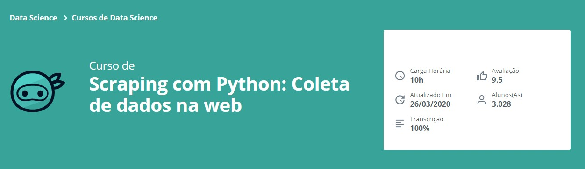

Repositório de desenvolvimento referente ao **Curso de Scraping com Python: Coleta de dados na web - Alura**

## Aprendido no curso
* Aprenda como obter o HTML de uma página e extrair informações
* Use o BeautifulSoup e Python para coletar dados
* Conheça os métodos mais importantes para pesquisar e navegar no HTML
* Acesse o conteúdo e atributos das tags HTML
* Construa um dataframe a partir dos dados

## Link para o Curso 
https://cursos.alura.com.br/course/web-scraping-data-science-python
